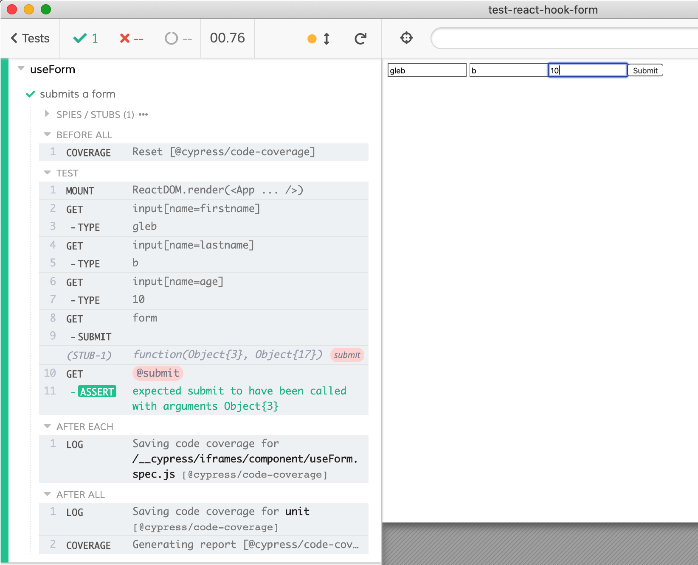

# test-react-hook-form

> Testing [react-hook-form](https://github.com/react-hook-form/react-hook-form) using Cypress and [cypress-react-unit-test](https://github.com/bahmutov/cypress-react-unit-test)

See [cypress/component/useForm.spec.js](cypress/component/useForm.spec.js)

```js
describe('useForm', () => {
  it('submits a form', () => {
    mount(<App onSubmit={cy.stub().as('submit')} />)
    cy.get('input[name=firstname]').type('gleb')
    cy.get('input[name=lastname]').type('b')
    cy.get('input[name=age]').type('10')
    cy.get('form').submit()
    cy.get('@submit').should('have.been.calledWith', {
      firstname: 'gleb',
      lastname: 'b',
      age: '10'
    })
  })
})
```


